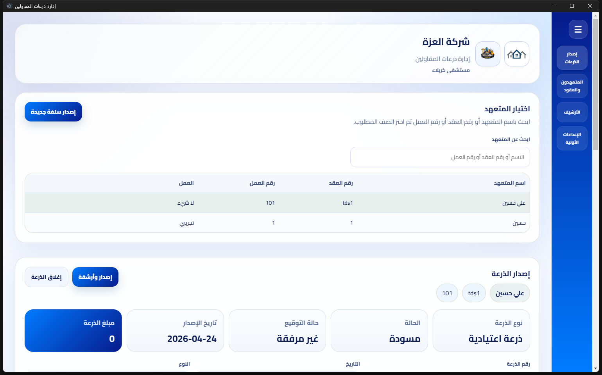
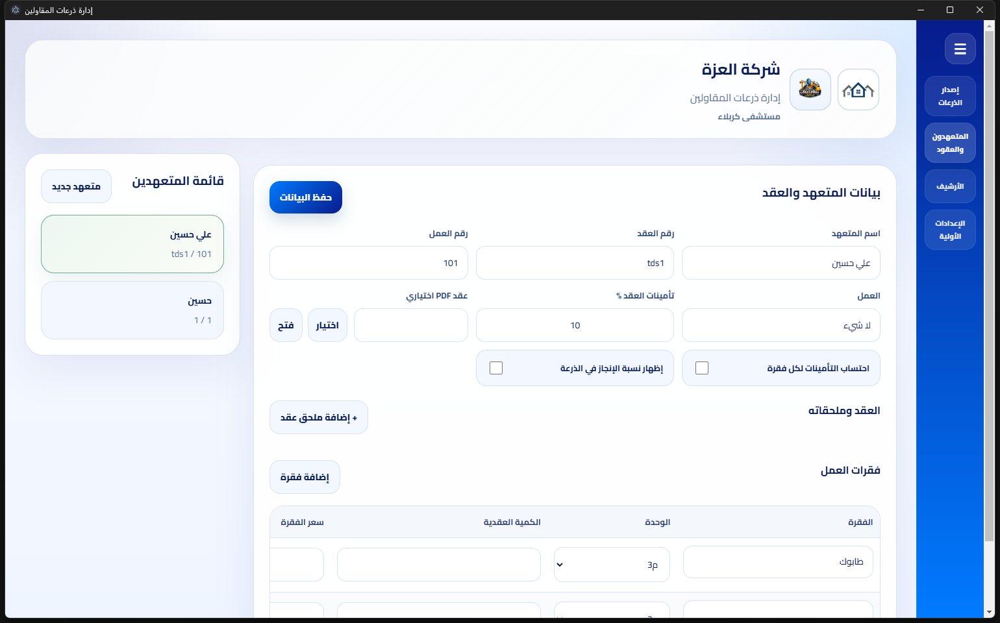

# إدارة ذرعات المقاولين

تطبيق سطح مكتب لإدارة ذرعات المقاولين والعقود والأرشفة والطباعة والتفعيل الأوفلاين.

## نظرة عامة

هذا المشروع هو نظام مكتبي مبني بـ `React + Electron` لإدارة:

- المتعهدين والعقود
- فقرات الأعمال
- الذرعات الاعتيادية وذرعات التصفية
- الأرشيف وملفات PDF
- المرفقات مثل العقد والنسخ الموقعة ومحاضر الاستلام
- التفعيل الأوفلاين والرخص التجريبية

## أهم الميزات

- إصدار ذرعات المقاولين وطباعة PDF
- أرشفة الذرعات وربط الملفات المرفقة
- حفظ محلي للملفات داخل مسارات يحددها المستخدم
- دعم شعار المشروع داخل البرنامج وفي الطباعة
- تفعيل أوفلاين مع مولد أكواد منفصل
- نسخة Demo افتراضية تسمح بإضافة مقاولين اثنين فقط

## صور من النظام

### الشاشة الرئيسية وإصدار الذرعات


### شاشة الذرعات



### شاشة المتعهدين والعقود



### شاشة الأرشيف


### شاشة الإعدادات


## التقنيات المستخدمة

- `React`
- `Electron`
- `sql.js / SQLite-style local storage layer`
- `electron-builder`
- `Node.js`

## متطلبات التشغيل

- Windows
- Node.js
- npm

> ملاحظة: هذا المشروع قديم نسبياً من جهة حزمة React Scripts، ولذلك عند البناء محلياً نستخدم:
>
> `NODE_OPTIONS=--openssl-legacy-provider`

## التشغيل أثناء التطوير

من داخل المجلد:

```powershell
cd D:\Invoice
$env:NODE_OPTIONS="--openssl-legacy-provider"
$env:PORT="3001"
npm start
```

## تشغيل نسخة سطح المكتب أثناء التطوير

```powershell
cd D:\Invoice
npm run desktop:dev
```

## بناء نسخة الويب

```powershell
cd D:\Invoice
$env:NODE_OPTIONS="--openssl-legacy-provider"
npm run build
```

## بناء نسخة EXE

```powershell
cd D:\Invoice
npm run desktop:build
```

## ملفات الإخراج

بعد البناء، ستجد النسخ التنفيذية عادة في:

- `D:\Invoice\dist\win-unpacked\إدارة ذرعات المقاولين.exe`
- `D:\Invoice\dist\إدارة ذرعات المقاولين Setup 0.1.2.exe`

## التفعيل والرخص

التطبيق يدعم:

- `Demo`
- `Monthly`
- `Yearly`
- `Lifetime`

### سلوك النسخة التجريبية

- تبدأ النسخة العادية كـ `Demo`
- تسمح بإضافة مقاولين اثنين فقط
- عند تجاوز الحد يظهر تنبيه بطلب التفعيل عبر:

`spardexlab@gmail.com`

## أداة التفعيل المنفصلة

يوجد داخل المشروع أداة مستقلة لتوليد أكواد التفعيل:

- مجلد الأداة: `D:\Invoice\activation-tool`

لبنائها:

```powershell
cd D:\Invoice
npm run activation-tool:build
```

## بنية المشروع

```text
D:\Invoice
├── activation-tool     # أداة توليد أكواد التفعيل
├── electron            # منطق Electron الرئيسي
├── public              # الأصول الثابتة والشعارات
├── src                 # واجهة التطبيق
├── tools               # أدوات مساعدة مثل توليد الرخص
├── dist                # ملفات البناء النهائية
└── package.json
```

## ملاحظات مهمة

- يفضّل حذف أي نسخ تنفيذية قديمة قبل اختبار نسخة جديدة
- يفضّل تجربة النسخة من `win-unpacked` أولاً قبل تثبيت `Setup`
- مسارات الملفات والشعار تُحدد من داخل الإعدادات داخل التطبيق

## حالة المشروع

المشروع مخصص كنسخة عمل فعلية لبرنامج:

`إدارة ذرعات المقاولين`

وقد تم تحويله من قاعدة مشروع قديمة إلى منتج مكتبي مخصص لهذا الغرض.

## المطور

Developed by **Spardex Lab**
